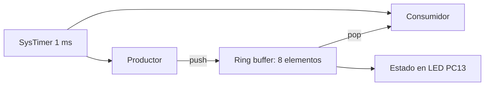
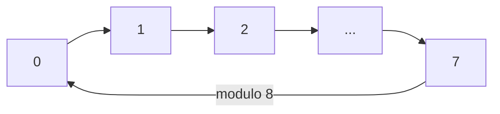

# Exercise 07 - Ring buffer productor-consumidor en GD32VW553

**Curso:** Estructuras Computacionales  
**Autora:** Laura Daniela Barragan Silva  
**Plataforma:** GD32VW553HMQ6/HMQ7  
**Arquitectura:** Nuclei RISC-V RV32  
**Entorno:** Visual Studio Code, CMake, Ninja, Nuclei RISC-V GCC y OpenOCD

## 1. Proposito

Este ejercicio implementa un **buffer circular FIFO** de ocho posiciones para
comunicar un productor y un consumidor con velocidades diferentes. Cada dato
incluye un numero de secuencia y el instante en que fue producido.

Se estudian:

- almacenamiento FIFO sin memoria dinamica;
- indices `head` y `tail` con retorno circular;
- estados vacio, parcial y lleno;
- desbordamiento, subdesbordamiento y marca de ocupacion maxima;
- latencia entre produccion y consumo;
- separacion entre el modulo de datos y la aplicacion.

## 2. Comportamiento esperado

El experimento repite tres fases de seis segundos:

| Fase | Productor | Consumidor | Efecto esperado |
| --- | ---: | ---: | --- |
| Equilibrada | 400 ms | 400 ms | Ocupacion baja, sin perdidas |
| Sobrecarga | 100 ms | 500 ms | El buffer se llena y rechaza datos |
| Drenaje | 800 ms | 100 ms | El consumidor vacia el buffer |

El LED PC13 representa la ocupacion:

| LED | Estado del buffer |
| --- | --- |
| Apagado | Vacio |
| Encendido fijo | Parcialmente ocupado |
| Parpadeo rapido | Lleno |

En la fase equilibrada se observan pulsos breves porque el productor deposita
un elemento y el consumidor lo retira poco despues. En sobrecarga el LED queda
encendido y finalmente parpadea rapido. Durante el drenaje regresa a apagado.

## 3. Arquitectura



## 4. Funcionamiento circular



`head` indica donde escribe el proximo productor y `tail` donde lee el
proximo consumidor. `count` distingue lleno de vacio incluso cuando los dos
indices tienen el mismo valor.

## 5. Estructura

```text
07_Ring_Buffer_Producer_Consumer/
├── .vscode/
├── Doc/
├── Inc/
│   ├── gd32vw55x_libopt.h
│   ├── ring_buffer.h
│   └── systimer.h
├── Src/
│   ├── main.c
│   ├── ring_buffer.c
│   └── systimer.c
├── cmake/
├── tools/
├── CMakeLists.txt
└── CMakePresets.json
```

## 6. Preparacion rapida

1. Abra esta carpeta mediante `File > Open Folder` en VS Code.
2. Acepte `Trust` si aparece el modo restringido.
3. Duplique `tools/local_config.example.ps1`, nombre la copia
   `local_config.ps1` y complete las tres rutas locales.
4. Ejecute `Terminal > Run Task > 1. Verificar entorno GD32`.
5. Ejecute `5. Compilar y programar GD32`.
6. Ejecute una sola vez `6. Preparar depuracion`.
7. Abra `Run and Debug`, seleccione el GD32 y pulse el boton verde.

El estudiante trabaja mediante tareas de VS Code; no necesita escribir
comandos PowerShell.

## 7. Variables principales

```text
g_ring_buffer
g_ring_buffer.storage
g_ring_buffer.head
g_ring_buffer.tail
g_ring_buffer.count
g_ring_buffer.high_watermark
g_ring_buffer.overflows
g_ring_buffer.underflows
g_phase
g_last_produced_sequence
g_last_consumed_sequence
g_last_latency_ms
g_sequence_errors
```

El repositorio excluye `build/`, rutas personales, el SDK, el compilador,
OpenOCD, `tools/local_config.ps1` y `.vscode/launch.json`.
